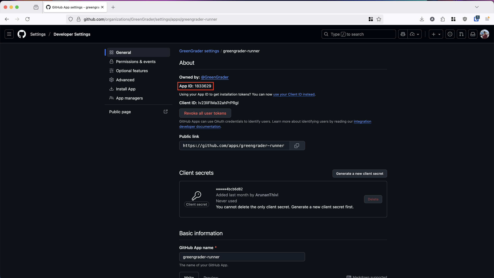
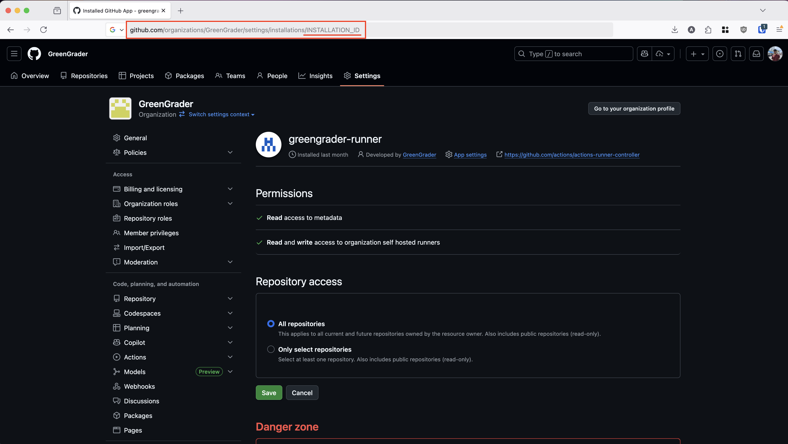
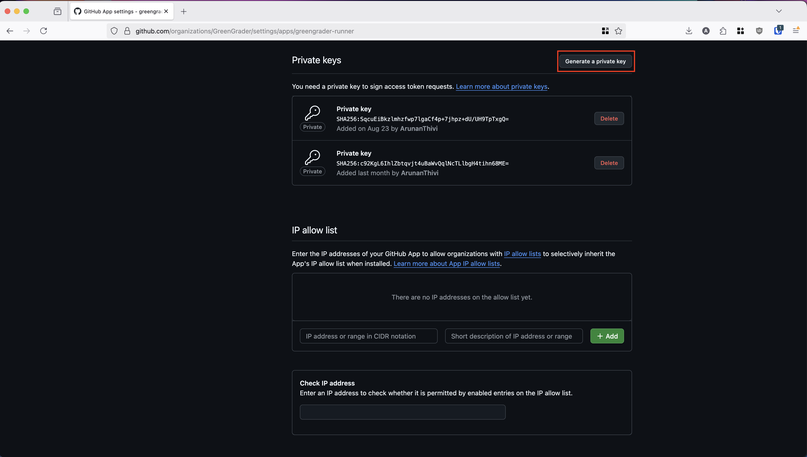

#

## Setting Up ARC
Set up the Github Actions Controller Runner with

```
./setup.sh
```

**NOTE:** Before running the setup wizard, ensure that an application has been made on Github, we'll use this app for authenticating Greengrader to the classroom organization. We will need the App ID, the installation ID, and a private key

The setup wizard will prompt with a couple of steps to ensure the setup is done properly
1. The URL for the organization the runner will be assigned to. This will usually be in the form of `https://Github.com/organization`
2. The App ID of the created Github App

3. The Installation ID when adding the created Github App to the organization

4. The path to the download Private Key of the created Github App

3. The minimum # of idle runners  (Default: 0). Increasing this value will decrease the cold start time at the cost of computation
4. The maximum # of runners that ARC will scale to (Default: None). Increasing this value will reduce peak latency at the cost of computation
<!-- 5. Limits for CPU and Memory for each runner (TODO) -->

After the setup wizard has completed, the controller should show up with `kubectl get pods -n arc-systems` and any runners should show with `kubectl get autoscalingrunnersets -n arc-runners`. The runners should also show up in the org/repo settings under Actions > Runners

## Setting up The Assignment
After setting up the Github app and connecting ARC to the organization, we can create an assignment using the Github Classroom UI. At the bottom of the page, we can define the tests to use for this assignment, as well as how often the tests should run (on student submission, on a schedule, or manually).

By default, Github Actions will choose to run actions on its own cloud-based infrastructure. To ensure that the autograding occurs on our cluster, we can edit the `.github/workflows/classroom.yml` file that is automatically created by Github Classroom.

We specifically want to change the line
```yaml
runs-on: ubuntu-latest
```
to
```yaml
runs-on: greengrader
```
**NOTE:** Editing the assignment in Github Classroom (e.g. adding/editing test cases) WILL reset this line back to its default value.

## Test Creation (Optional)
Github's autograding implementation requires that tests be included in the student repos, with no option to hide test cases. To mitigate this problem, `testsCreator.go` is included to build the test cases into a binary which Github can then run directly to produce the student's score.

The `testsCreator.go` file takes in a JSON file of test cases and produces a binary for each test. The script can be run with

```bash
go run testsCreator.go <tests.json> <output prefix> <command> [args...] [--strict]
```

Where `tests.json` includes the test cases in a structure like

```
[
    {
        "input": "inputString",
        "output": "outputString",
        "hidden": false
    },
    {
        "input": "hiddenTestInput",
        "output": "hiddenTestOutput",
        "hidden": true
    },
    ...
]

```

The program will then produce binaries `prefix_test1` `prefix_test2`, etc for all the tests, which can then be included in the starter repo and configured to run through the github classroom autograder.

The strict flag changes matching from inclusion to exact

**Note:** The binaries by default are set to cross-compile to an ARM64 Linux-compatible executable. Therefore, there may be issues if the autograding hardware is of a different OS/architecture.

**TODO:** Currently the script only handles a single input and a single output. Multiple sequential input is still to be implemented.

**DEMO:** Create tests with 

* `go run testsCreator.go tests.json python python demo.py`(Python)
* `go run testsCreator.go tests.json exec ./demo` (Golang)

then test the included programs with `tests/python_test1`or 
`tests/exec_test1`

